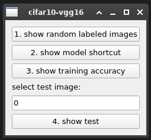
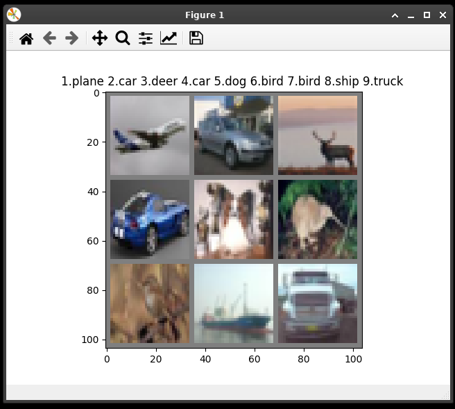
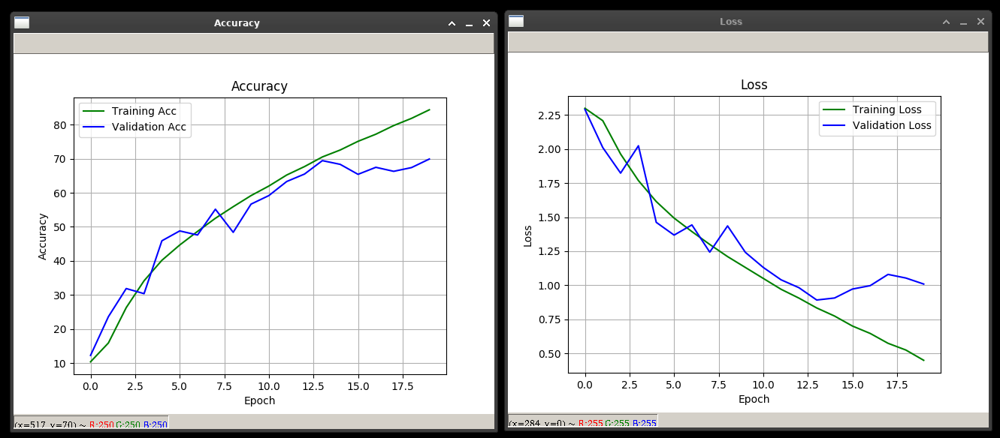
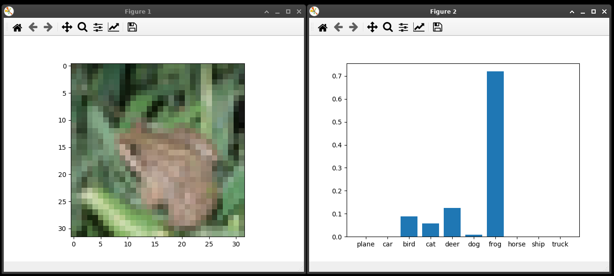

# cifar10-vgg16

PyTorch VGG16 for CIFAR10.

To train: `python vgg16train.py`

Here are some changeable variables in `vgg16train.py`:

```python
BATCH_SIZE = 128
LEARNING_RATE = 0.01
EPOCH = 20
FILENAME = "vgg16.pth"
```

You can also download [pre-trained model](https://github.com/blueskyson/cifar10-vgg16/releases) from releases.

To execute test application: `python main.py`

## Screenshots



- Show random labeled images  
  
- Show training accuracy  
  
- Show test  
  